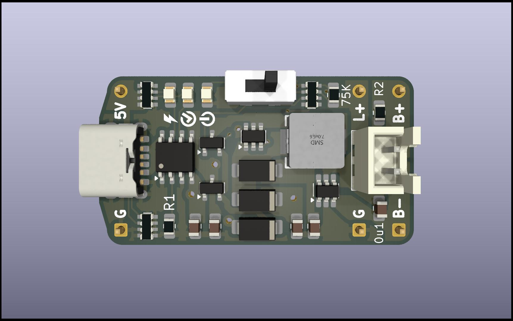

# Li-ion 5V UPS

Features:

* Li-Ion battery charger ([TP4056][tp4056])
* Battery protection with 3V discharge cutoff ([XB5307H][xb5307h],
  [english translation](/datasheets/XySemi-XB5307H-en.pdf))
* Load-sharing circuit
* 5V boost converter ([MT3608][mt3608])

## Acknowledgements

Built from scratch using the IC datasheet application circuits, but inspired by
[@wagiminator][wagiminator-power-boards]'s [TP4056 LiPo Charger LS][wagiminator-tp4056-lipo-charger-ls] and
[MT3608 12V Boost Converter Stick][wagiminator-mt3608-12v-boost-converter].

[mt3608]: https://www.olimex.com/Products/Breadboarding/BB-PWR-3608/resources/MT3608.pdf
[tp4056]: https://dlnmh9ip6v2uc.cloudfront.net/datasheets/Prototyping/TP4056.pdf
[wagiminator-mt3608-12v-boost-converter]: https://github.com/wagiminator/Power-Boards/tree/master/Boost_Converter_MT3608
[wagiminator-power-boards]: https://github.com/wagiminator/Power-Boards
[wagiminator-tp4056-lipo-charger-ls]: https://github.com/wagiminator/Power-Boards/tree/master/LiPo_Charger_LS_TP4056
[xb5307h]: https://www.lcsc.com/datasheet/lcsc_datasheet_1811021123_XySemi-XB5307H_C154942.pdf
